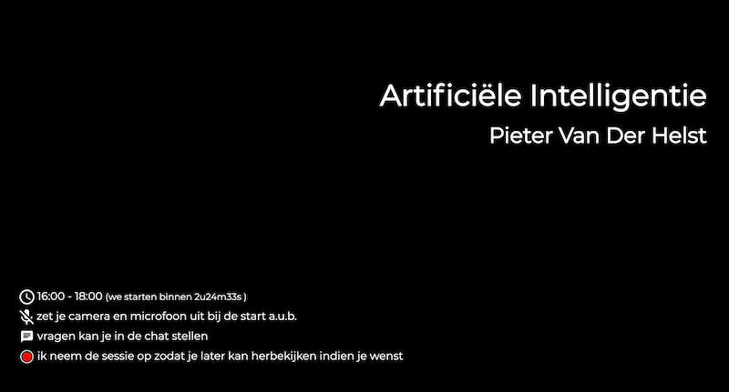
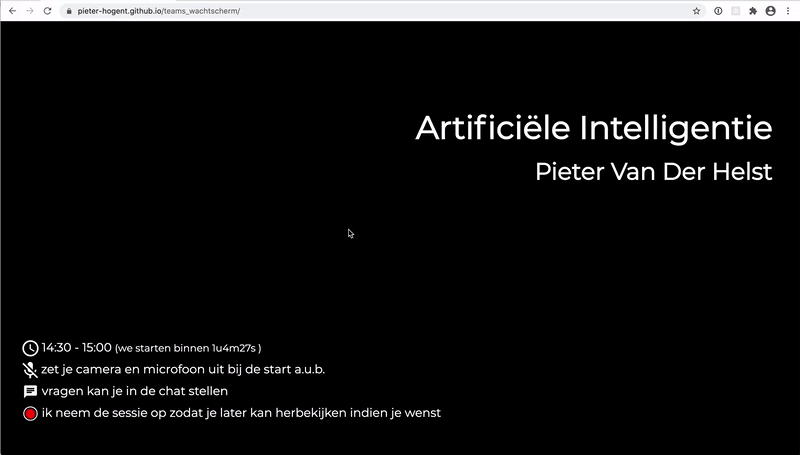

# wachtscherm

Wachtscherm dat je kan gebruiken om Teams lessen al een tijdje op voorhand op te starten, zodat studenten klaar zitten als je gaat starten, en ze weten waar ze aan toe zijn m.b.t. chat / camera / ...

De inhoud kan aangepast worden door de muis linksboven van het venster te bewegen, er verschijnt een 'edit' knop, daar op klikken opent een kleine form, die met een close button rechtsboven kan gesloten worden.

Alles draait binnen je eigen browser, de inhoud wordt bewaard in de browser zelf (dus je naam ga je niet telkens moeten aanpassen)

Het aanpassen van start- en einduur werkt minder handig op Safari voor macOS. Om één of andere reden weigert Apple het input-time element te implementeren daar. (hoewel ze het in iOS al 8 jaar ondersteunen ondertussen...)
Alles werkt er wel, maar je krijgt een gewoon input-text, geef uren in als '14:30'
